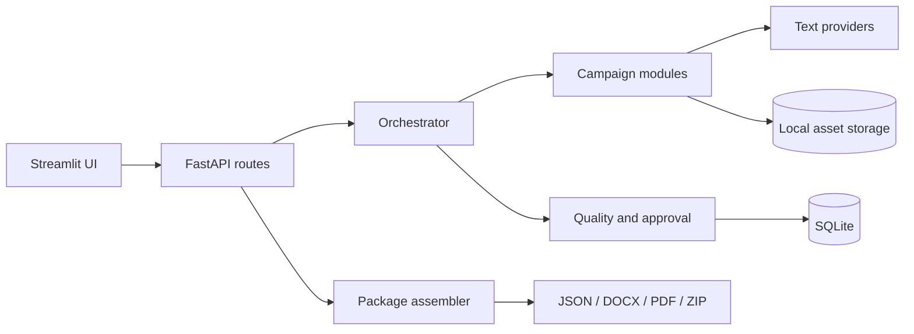

# Architecture

```mermaid
flowchart LR
    UI[Streamlit UI] --> API[FastAPI routes]
    API --> ORCH[Orchestrator]
    ORCH --> GEN[Campaign modules]
    GEN --> TEXT[Text providers]
    ORCH --> QA[Quality and approval]
    QA --> DB[(SQLite)]
    API --> PACKAGE[Package assembler]
    PACKAGE --> EXPORT[JSON / DOCX / PDF / ZIP]
    GEN --> ASSETS[(Local asset storage)]
```

The detailed architecture is in [docs/stage2/01_architecture.md](stage2/01_architecture.md).
